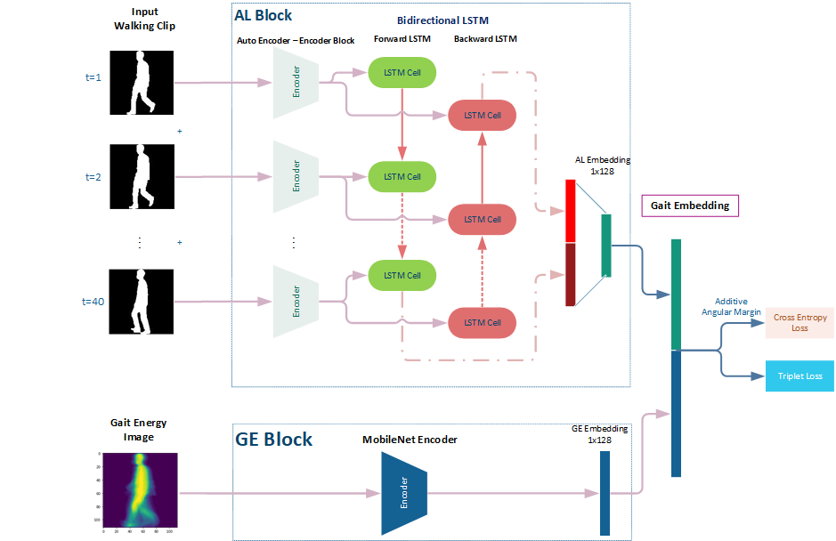
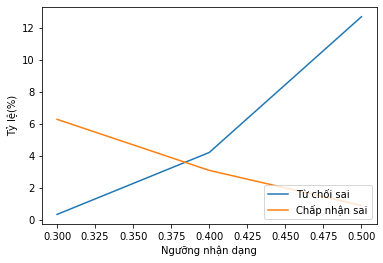

# Gait CAL



Out method uses a modified architecture. As show on flowchart, the walking clip are processed by 2 separate streams. Firstly, we call AL block, contain the encoder and BiLSTM to extract gait details. Secondly, the GE block create GEI by sum of all frames and encode it with MobileNet, it describe the overall gait . Two vector are joined and we call it Gait Embedding.    
***
## Data
We using synthetic dataset from Casia B, HID Gait, Outdoor Gait:  
[Download Synthetic Dataset](https://drive.google.com/file/d/1OKx_W7rJbGP-t6TAGFJr2fK8LLzn3dZA/view?usp=share_link)  

Create Gait CAL dataset with notebook ```create_gai_fc_dataset.ipynb```

## Train
- Auto Encoder: ```train_ae.ipynb```  
- Network was trained by Additive Angular Margin Loss and Triplet Loss:   
Arc Loss: ```train_gait_fc_v2.ipynb```   
Triplet Loss: ```train_gait_fc.ipynb```
## Evaluate
Equal error rate (EER): ```evaluate_gait_fc_quickly.ipynb```  
Accuracy and Confusion Matrix (EER): ```evaluate_gait.ipynb```  




## Author

Da Nang University of Science and Technology

## Contact
Email: ```cuongtran73d1@gmail.com```

